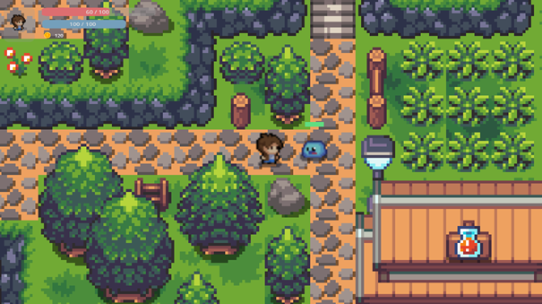

# Slime World

Welcome to the official repository of Slime World, a 2D top-down adventure developed using the powerful open-source game engine, Godot. Our game is designed to bring a unique blend of exploration and action to players, set in a beautifully crafted world.

## About the Game

Slime World is set in colorfull pixelated world. Players will take on the role of navigating through forests, cities and more, to uncover mysteries, fight enemies, and defend against various foes.

### Features

- **Engaging Storyline:** Your placed into a world overrun by slimes and need to restore the land and free the citizens.
- **Dynamic Combat System:** Combat with diferant types of slimes is a core feature.
- **Exploration:** there are muliple islands where players can discover and fight foes
- **Customization:** players can be customized with hats, clothing and so on.

## Getting Started

To play Slime World, you can download the latest releases.
[Link to releases](https://github.com/Robbevanherpe1/Slime_World/releases)

### Installation

For instalation follow these steps:

1. Step one: go to releases and pick the most recent one
2. Step two: download the .exe file
3. Step three: run the exe

## Contributing

We welcome contributions to Slime World! If you're interested in helping improve the game or add new features, please take a look at our contributing guidelines. To get started:

1. Fork the repository.
2. Create a new branch for your feature (`git checkout -b feature/AmazingFeature`).
3. Commit your changes (`git commit -m 'Add some AmazingFeature'`).
4. Push to the branch (`git push origin feature/AmazingFeature`).
5. Open a pull request.

## License

Slime World is released under the GNU GPLv3 Licence, see [LICENSE](LICENSE.md) for more details.

## Acknowledgments

- Godot Engine, for making this project possible.
- [art resources that contributed to the project](https://game-endeavor.itch.io/mystic-woods)

Thank you for checking out Slime World. We hope you enjoy playing it as much as we've enjoyed making it!
